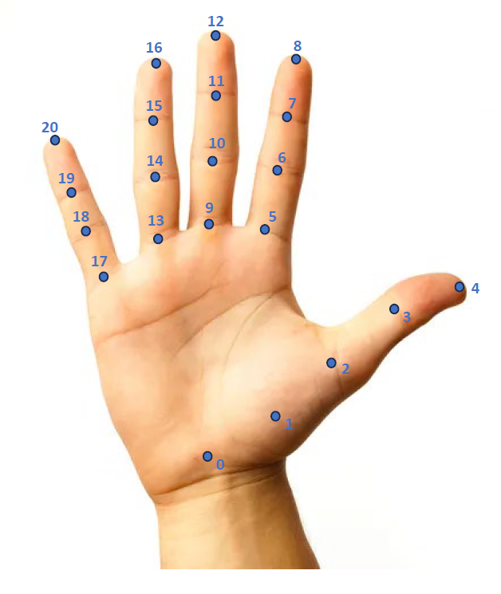

# Hand Ego Pose Data Preparation
Data preparation for hand ego-pose benchmark task in [Ego4D](https://github.com/facebookresearch/Ego4d/tree/main), [paper](https://arxiv.org/abs/2311.18259). See below with instructions on how to get undistorted ego view (aria) images.

## Instruction

### Step 0: Download Ego4D data
Follow [instructions](https://github.com/facebookresearch/Ego4d/tree/main?tab=readme-ov-file#setup) to set up Ego4D downloader CLI. Then download `annotation`, `metadata` `capture_raw_vrs` and `takes`:
```
egoexo -o <ego4d-out-dir> --parts annotations metadata capture_raw_vrs takes
```

### Step 1: Set-up environment
```
conda create -n ego_hand_pose_data python=3.9.16 -y
conda activate ego_hand_pose_data
pip install -r requirement.txt
```

### Step 2: Generate ground-truth annotation JSON file 
Run `main.py` with `steps=gt_anno` to generate ground truth annotation file. Default is to create ground truth annotation JSON file for manually annotated data in all splits (`train/val/test`).

```
python3 main.py \
    --steps gt_anno
    --ego4d_data_dir <ego4d-out-dir> \
    --gt_output_dir <gt-output-dir>
```

Four annotation JSON files will be generated:
- **ego_pose_gt_anno_train_public.json**: includes 3D hand joints coordinates, hand bbox and valid hand joints flag in all annotation available `train` takes. Available to public. 
- **ego_pose_gt_anno_val_public.json**: includes 3D hand joints coordinates, hand bbox and valid hand joints flag in all annotation available `val` takes. Available to public. 
- **ego_pose_gt_anno_test_public.json**: includes hand bbox in all annotation available `test` takes. Available to public. 
- **ego_pose_gt_anno_test_private.json**: includes 3D hand joints coordinates, hand bbox and valid hand joints flag in all annotation available `test` takes. Not available to public, only for server evaluation.

A sample of four ground truth annotation files can be found from [here](https://drive.google.com/drive/folders/17TYpJl523r8nzjRB3cBzxbhr2BhM7R8U?usp=sharing).

### Step 3: Extract & undistort Aria images
Run `main.py` with `steps=raw_image undistorted_image` to first extract Aria raw images to `gt_output_dir`, then perform undistortion to get undistorted Aria images. Default is to extract and undistort all manually annotated frames used in all splits (`train/val/test`).
```
python3 main.py \
    --steps raw_image undistorted_image \
    --ego4d_data_dir <ego4d-out-dir> \
    --gt_output_dir <gt-output-dir>
```

## Note
For the 21 keypoints annotation in each hand, its index and label are listed as below:
```
{0: Wrist,
 1: Thumb_1, 2: Thumb_2, 3: Thumb_3, 4: Thumb_4,
 5: Index_1, 6: Index_2, 7: Index_3, 8: Index_4,
 9: Middle_1, 10: Middle_2, 11: Middle_3, 12: Middle_4,
 13: Ring_1, 14: Ring_2, 15: Ring_3, 16: Ring_4,
 17: Pinky_1, 18: Pinky_2, 19: Pinky_3, 20: Pinky_4}
```
The 21 keypoints for right hand are visualized below, with left hand has symmetric keypoints position. 

