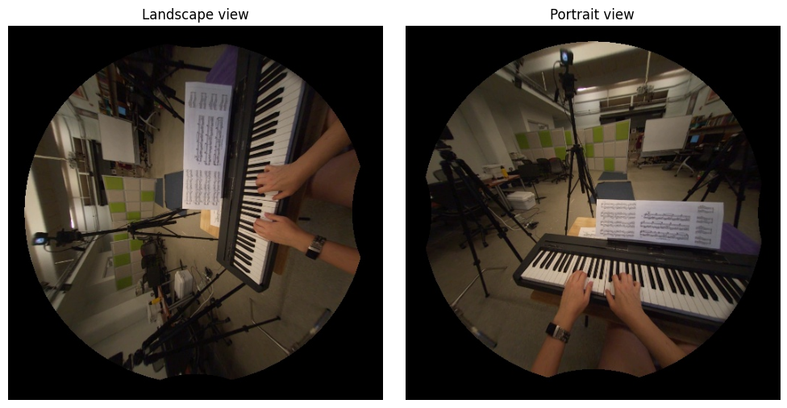

# Hand Ego Pose Data Preparation
Data preparation for hand ego-pose benchmark task in [Ego-Exo4D](https://github.com/facebookresearch/Ego4d/tree/main), [paper](https://arxiv.org/abs/2311.18259), [EvalAI challenge](https://eval.ai/web/challenges/challenge-page/2249/overview).

## Getting Started
Follow instructions below to 
- Prepare environments
- Download and pre-process the hand ego pose data, including undisorted Aria images and corresponding 2D & 3D hand pose annotations.   

We provide scripts to download and prepare data for both manually and automatically annotated takes. 
Considering the data size, we encourage the users to start with manually annotationed takes first. 
See [paper](https://arxiv.org/abs/2311.18259) for details on automatic annotations and how it can help improve the performance.  

## Folder naming conventions
- `$egoexo_output_dir`: Directory of the data downloaded by Ego-Exo4D CLI Downloader.
- `$gt_output_dir`: Output directory of processed hand ego pose data, which will be generated later.

## Set up
Run command below to install necessary packages.
```
pip install -r requirement.txt
```
Install [Ego-Exo4D CLI Downloader](https://github.com/facebookresearch/Ego4d/tree/main?tab=readme-ov-file#setup)
```
pip install ego4d --upgrade
```

## Data download and preparation
### Step 1: Download Ego-Exo4D annotations
Download ego pose related `annotations` and `metadata` for manual annotations:
```
egoexo -o $egoexo_output_dir --parts annotations metadata --benchmarks hand_pose
```
Download ego pose related `annotations` and `metadata` for both manual and automatic annotations:
```
egoexo -o $egoexo_output_dir --parts annotations metadata ego_pose_pseudo_gt --benchmarks hand_pose
```

### Step 2: Download Ego-Exo4D frame aligned videos for annotated takes

```
# 1. change to data preparation directory
cd handpose/data_preparation/

# 2. Download maunually annotated take's frame aligned videos
python3 scripts/download.py \
    --ego4d_data_dir $egoexo_output_dir \
    --parts takes
```
Additional filters can be applied based on splits and annotation type (see details below). Default is to download data for all manually annotated takes in all splits.

Filter based on:
- `--splits`: valid option: `train`, `val`, `test`
- `--anno_type`: valid option: `manual`, `auto`

### Step 3: Extract Aria camera parameters for image undistortion.  
We provide two options:
- Option 1: download `take_vrs_noimagestream` which is a set of vrs files without image data.  
- Option 2: skip `take_vrs_noimagestream` download and get pre-generated aria calibration JSON files.  

#### Option 1: Download `take_vrs_noimagestream`
******* Bug report: This will not download vrs for test split *******  
Download `take_vrs_noimagestream` for all annotated takes. Default is to download data for all manually annotated takes in all splits.
```
python3 scripts/download.py \
    --ego4d_data_dir $egoexo_output_dir \
    --parts take_vrs_noimagestream
```
Generate Aria calibration JSON files which will be used later for Aria image undistortion. Default is to generate calibration file for all manually annotated takes in all splits.
```
python3 main.py \
    --steps aria_calib
    --ego4d_data_dir $egoexo_output_dir \
    --gt_output_dir $gt_output_dir
```  
The generated files should be stored in `$gt_output_dir/aria_calib_json/takes`  

#### Option 2: Download pre-generated Aria calibration JSON file
Download pre-generated Aria calibration files for manually annotated files from [here](https://drive.google.com/file/d/1Emi-Zcl2uJKmZo9FARpPT-ASHxT8qchj/view?usp=drive_link). Extract all the JSON files and put it under `$gt_output_dir/aria_calib_json/takes`.  
*NOTE: If you choose to follow option 2, please check if the calibration file exists for every take as this list might not be up-to-date.*

### Step 4: Download hand bounding box file for test data
Move test split hand bounding box file ([ego_pose_gt_anno_test_public.json](https://github.com/EGO4D/ego-exo4d-egopose/blob/main/handpose/data_preparation/ego_pose_gt_anno_test_public.json)) 
in `$gt_output_dir/annotation/manual` (and also `$gt_output_dir/annotation/auto` if using automatically annotated data).  
The structure of `ego_pose_gt_anno_test_public.json` is:  
```
{
    <"take_uid">: {
        <"frame_number">: {
            "right_hand_bbox": a (4,) array for right hand bounding box with format xyxy. 
                            Empty if the hand is invisible and not evaluated.  
            "left_hand_bbox": a (4,) array for left hand bounding box with format xyxy. 
                            Empty if the hand is invisible and not evaluated.  
            "metadata": some metadata for the take and the frame.
        }
        ...
    }
    ...
}
```

### Step 5: Prepare annotation JSON files for training
Raw Ego-Exo4D 3D annotations are in the world coordinate frame. Here we provide the script to transform it to the egocentric coordinate frame.   
In this step, we also filter valid 3D annotations by geometry and biomechanical constraints for train/val data, and save it as a valid flag in the generated files. 
We encourage but do not require the users to use it as a data cleanup process.  

Default is to create ground truth annotation JSON files for manually annotated data in all splits (`train/val/test`).  
Use `--anno_type auto` for takes with only auto annotations.
```
python3 main.py \
    --steps gt_anno
    --ego4d_data_dir $egoexo_output_dir \
    --gt_output_dir $gt_output_dir
```

Two annotation JSON files will be generated:
- **ego_pose_gt_anno_train_public.json**: includes 2D hand joints coordinates, 3D hand joints coordinates, hand bbox and valid hand joints flag (3d kpts) in all annotation available `train` takes. 
- **ego_pose_gt_anno_val_public.json**: includes 2D hand joints coordinates, 3D hand joints coordinates, hand bbox and valid hand joints flag (3d kpts) in all annotation available `val` takes.

The structure of for the generated annotation file is:  
```
{
    <"take_uid"> :{
        <"frame_number">: {
            "right_hand_2d": a (21,2) array for 2D annotations for each joint, joint ordering in note. 
                            Empty if the hand is invisible, and NaN if the joint is invisible. 
            "right_hand_3d": a (21,3) array for 3D annotations for each joint, joint ordering in note.  
                            Empty if the hand is invisible, and NaN if the joint is invisible. 
            "right_hand_bbox": a (4,) array for hand bounding box with format xyxy. 
                            Empty if the hand is invisible. 
            "right_hand_valid_3d": a (21,) array to show if each joint has valid 3D annotation.
                            Empty if the hand is invisible.
            the same entries for left hand ...
            "metadata": some metadata for the take and the frame.
        }
        ...
    }
    ...
}
```

### Step 6: Extract & undistort Aria images
Run `main.py` with `steps=raw_image undistorted_image` to first extract Aria raw images to `$gt_output_dir`, then perform undistortion to get undistorted Aria images. Default is to extract and undistort all manually annotated frames used in all splits (`train/val/test`). Also the image orientation is in landscape view (default), See [here](#landscape-vs-portrait-view) for view orientation explanation.
```
python3 main.py \
    --steps raw_image undistorted_image \
    --ego4d_data_dir $egoexo_output_dir \
    --gt_output_dir $gt_output_dir
```
Please refer to [visualization.ipynb](https://github.com/EGO4D/ego-exo4d-egopose/blob/main/handpose/data_preparation/visualization.ipynb) to visualize 2D and reprojected 3D annotations on a specific frame. 

## Notes

### Hand joint index
For the 21 keypoints annotation in each hand, its index and label are listed as below:
```
{0: Wrist,
 1: Thumb_1, 2: Thumb_2, 3: Thumb_3, 4: Thumb_4,
 5: Index_1, 6: Index_2, 7: Index_3, 8: Index_4,
 9: Middle_1, 10: Middle_2, 11: Middle_3, 12: Middle_4,
 13: Ring_1, 14: Ring_2, 15: Ring_3, 16: Ring_4,
 17: Pinky_1, 18: Pinky_2, 19: Pinky_3, 20: Pinky_4}
```
The 21 keypoints for right hand are visualized below, with left hand has symmetric keypoints position. 


### Landscape vs. Portrait view
When generating ground truth annotation and Aria images, the default orientation is *landscape view* following the convention of Aria glasses. 
See figure below for landscape view vs. portrait view. 

You can change the Aria images and 2D annotations to *portrait view* by adding `--portrait_view` flag in step 5 and step 6. Please make sure to keep consistent view orientation between annotations and images.  
See [visualization.ipynb](https://github.com/EGO4D/ego-exo4d-egopose/blob/main/handpose/data_preparation/visualization.ipynb) for an example to keep consistency for 3D annotations by rotating Aria camera pose.   
TODO: add to the script

