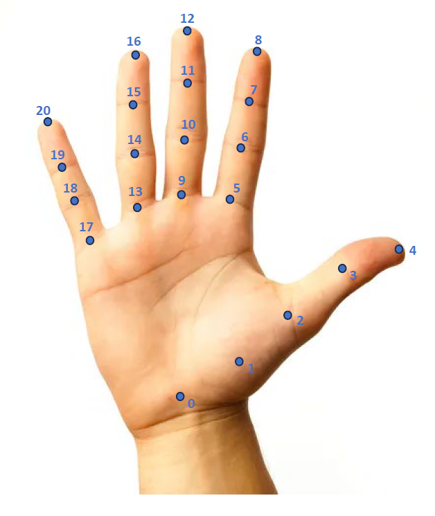

# Ego-Exo4D Hand Ego Pose Baseline Model 
Implementation of hand-ego-pose-potter, a 3D hand pose estimation baseline model based on [POTTER](https://github.com/zczcwh/POTTER/tree/main) in [Ego-Exo4D](https://github.com/facebookresearch/Ego4d) hand ego pose benchmark.


## Download Data

To perform model inference or training, you need to have 1. ground truth annotation files 2. corresponding undistorted Aria images 3. pretrained model weight. Follow instruction below to download necessary data.

### Step 1: Download ground truth annotation file

Download ground truth annotation file from [here](https://drive.google.com/drive/folders/1F7pz21ejW6J5Eu6Mhhzm9HQ0neFrxrul?usp=sharing) and put it at `<gt_anno_dir>`.  
comment: if following the data preparation step, the annotation files should be in ...

### Step 2: Download Aria images

Download undistorted Aria images from [here](https://drive.google.com/drive/folders/1R2v-xdiQ919sBGgL_MQZtsgsB4BTxVQl?usp=sharing) and put it at `<aria_img_dir>`. (TODO: add train and val images)  


### Step 3: Download model weight
Download pretrained model weight of hand-ego-pose-potter from [here](https://drive.google.com/drive/folders/1WSvV7wvmYBvFhB5KwK6PRXwV5dpHd9Hf?usp=sharing).
comment: if following the data preparation step, the images should be in ...

## Setup

- Follow instructions below to set-up environment for model training and inference.
```
conda create -n potter_hand_pose python=3.9.16 -y
conda activate potter_hand_pose
pip install -r requirement.txt
```
- Install `pytorch`. The model is tested with `pytorch==2.1.0` and `torchvision==0.16.0`. 


## Training

Download POTTER_cls model weights from [here](https://github.com/zczcwh/POTTER/tree/main/image_classification#2-poolattnformer-models-in-paper-we-denote-as-potter_cls). Put all model weight at `${ROOT}/output/ckpt` directory.  
comment: download model `poolattnformer_s12` and rename it to `cls_s12.pth`

Run command below to perform training on manual data with pretrained POTTER_cls weight:
```
python3 train.py \
    --gt_anno_dir <gt_anno_dir> \
    --aria_img_dir <aria_img_dir>
```
If choose to finetuning on manual data with pretrained weight on automatic data, set `pretrained_ckpt` to be the path of pretrained hand-ego-pose-potter model weight.

## Inference

The model inference output need to be saved as a single JSON file with specific format:
```
{
    "<take_uid>": {
        "<frame_number>": {
                "left_hand": [],
                "right_hand": []     
        }
    }
}
```

You can also find one sample inference output JSON file from [here](https://drive.google.com/file/d/1t9U3Em_Y5sjTN5_4GZ6S6rnYUNI5L943/view?usp=sharing).

Run command below to perform inference of pretrained model on test set, and save the inference output as a single JSON file. It will be stored at `output/inference_output` by default. 
```
python3 inference.py \
    --pretrained_ckpt <pretrained_ckpt> \
    --gt_anno_dir <gt_anno_dir> \
    --aria_img_dir <aria_img_dir>
```
comment: current trained model is with respect to image orientation up-down. Thus generate large error for image with orientation left-right. 

## Note
For the 21 keypoints annotation in each hand, its index and label are listed as below:
```
{0: Wrist,
 1: Thumb_1, 2: Thumb_2, 3: Thumb_3, 4: Thumb_4,
 5: Index_1, 6: Index_2, 7: Index_3, 8: Index_4,
 9: Middle_1, 10: Middle_2, 11: Middle_3, 12: Middle_4,
 13: Ring_1, 14: Ring_2, 15: Ring_3, 16: Ring_4,
 17: Pinky_1, 18: Pinky_2, 19: Pinky_3, 20: Pinky_4}
```
The 21 keypoints for right hand are visualized below, with left hand has symmetric keypoints position. 

